# Fast Fashion Project 

This project uses a dataset on major fashion brands to explore sustainability trends and impacts. In this scenario, I work as a Data Analyst at a global non-profit organization committed to reducing the negative effects of fast fashion on the environment, workers, and consumers. The organization has provided access to the [fashion_sustainability](true_cost_fast_fashion.csv) dataset, which contains multi-year data on economic metrics (GDP contribution, prices, production volumes), environmental impact metrics (carbon emissions, water usage, waste), and labor metrics (average working hours, salaries).

Using SQL and Power BI, this project analyzes trends, identifies key sustainability challenges, and provides actionable insights to support the organization’s mission.

## Project Overview 📖

In order to create an easy to follow order, the Project will be split into four parts: Revenue Analysis, Environmental Impact, Working Conditions, and Social Media.

## Process ⚙️

I used DBeaver, PostgreSQL, and VS Code to write and run SQL queries, which allowed me to extract key insights from the dataset. These insights were then imported into Power BI, where I created an interactive dashboard to visualize trends and highlight key findings.

## Revenue Analysis 💰

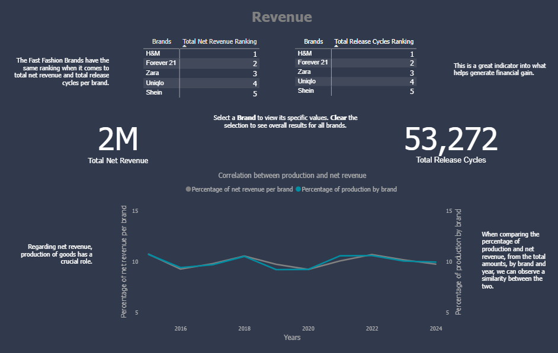

This section explores the financial performance of major fast fashion brands, examining trends in revenue and production over time.

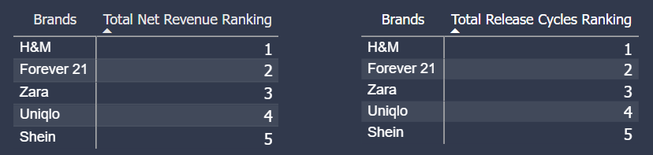

The rankings of Fast Fashion Brands are consistent when comparing total net revenue and total release cycles per brand. This alignment highlights a strong link between production activity and financial performance.

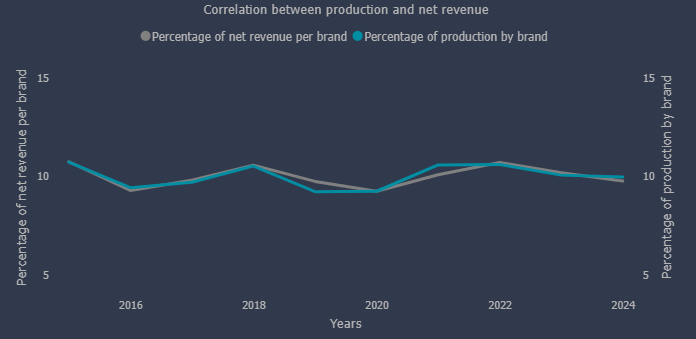

Production volume plays a critical role in net revenue generation. By comparing each brand’s share of total production to its share of total revenue, we observe a clear correlation between the two across brands and years.

## Environmental Impact 🌱

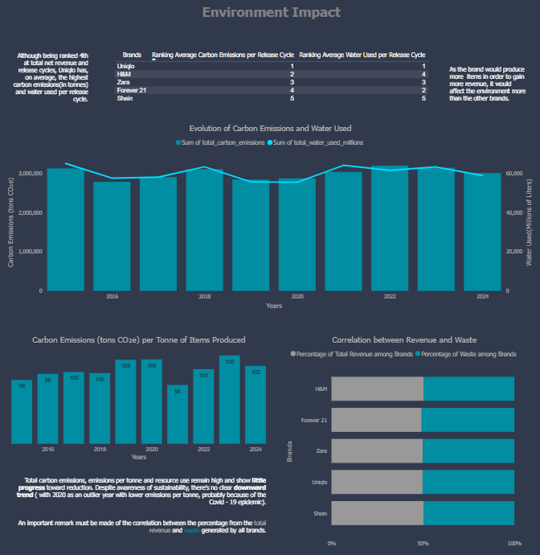

This section investigates the environmental footprint of each brand, including carbon emissions, water usage, and waste generation.

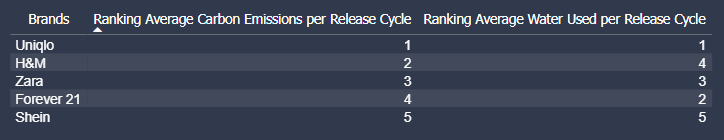

Despite ranking 4th in total net revenue and release cycles, Uniqlo has the highest average carbon emissions (in tonnes) and water usage per release cycle. This suggests that increased production to boost revenue has a disproportionately higher environmental impact for this brand compared to its peers.

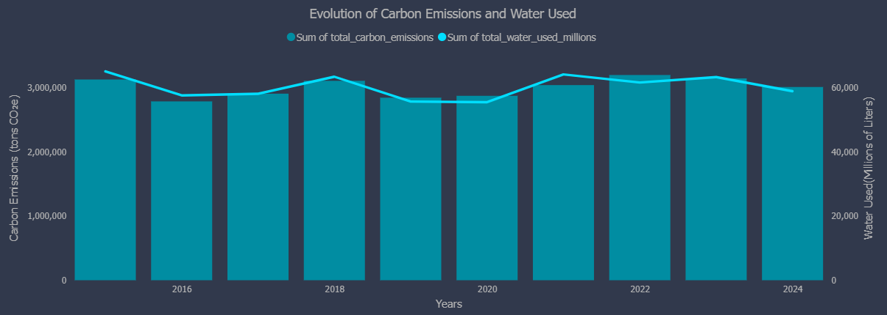
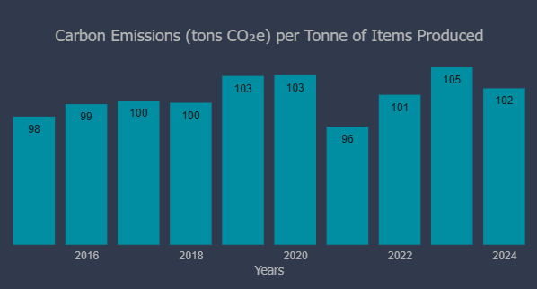
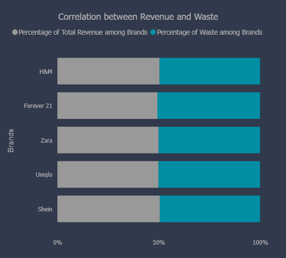

Overall, total carbon emissions, emissions per tonne, and resource usage remain high, with little evidence of reduction over time. Although sustainability awareness has increased, there is no clear downward trend, except for 2020, likely influenced by the COVID-19 pandemic. There is also a notable correlation between brands’ revenue share and the waste they generate, indicating that higher revenue often comes at a greater environmental cost.

## Working Conditions 👷‍♂️

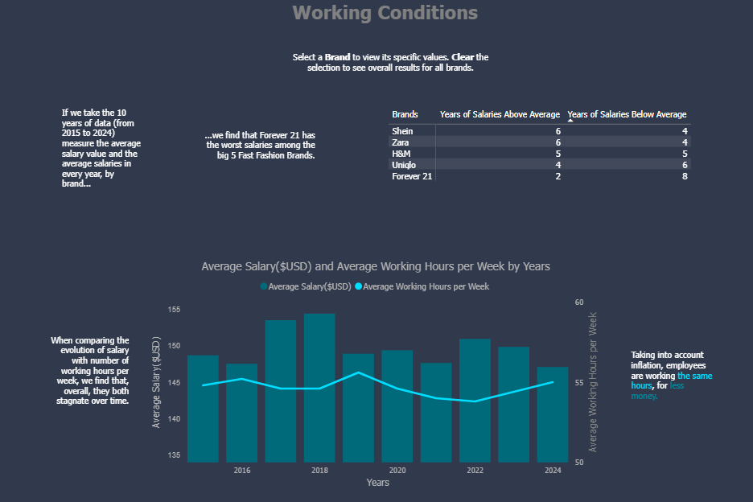

This section analyzes labor metrics such as average salaries and working hours to assess employee well-being across brands.

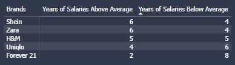

Analyzing data from 2015 to 2024, we examined average salaries across brands and years. Forever 21 consistently offers the lowest wages among the five major Fast Fashion Brands.

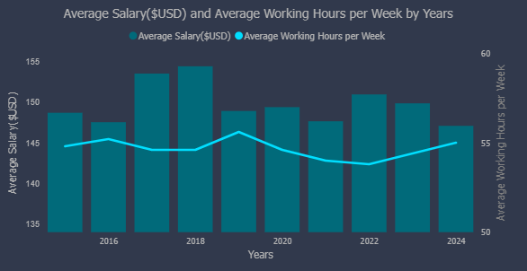

When comparing salary trends with average weekly working hours, both metrics show minimal change over time. Adjusted for inflation, this suggests that employees are effectively working the same hours for decreasing real pay.

## Social Media 📱

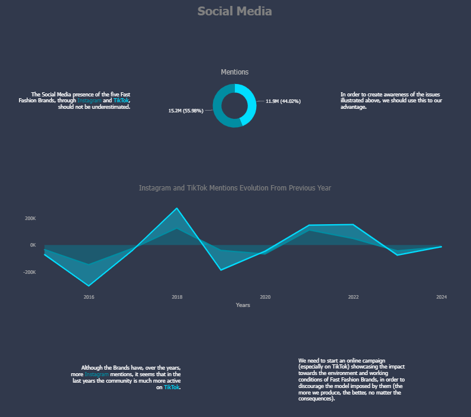

This section examines how fast fashion brands engage with consumers on social media platforms, highlighting trends and potential opportunities for awareness campaigns.

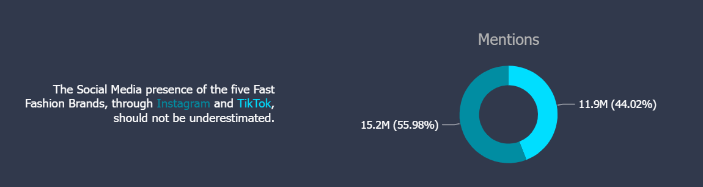

The social media presence of these five brands, particularly on Instagram and TikTok, is substantial. This engagement can be leveraged to raise awareness about environmental and labor issues in the fast fashion industry.

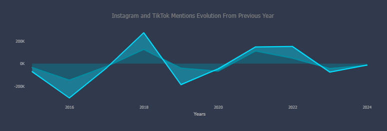

While Instagram mentions have increased over the years, TikTok engagement has grown significantly more recently. Launching a targeted online campaign—especially on TikTok—could help communicate the environmental and labor impacts of fast fashion and encourage more responsible consumption.

## Key Insights at a Glance 📊

- **Revenue Analysis:** Production volume closely correlates with net revenue; brands with more release cycles generally generate higher revenue.  
- **Environmental Impact:** High-production brands, like Uniqlo, have disproportionately high carbon emissions and water usage; overall environmental metrics show little reduction over time.  
- **Working Conditions:** Forever 21 offers the lowest wages among major brands; salaries and working hours have stagnated when adjusted for inflation.  
- **Social Media Presence:** TikTok engagement has grown faster than Instagram; social media can be leveraged to raise awareness about sustainability and labor issues.

## Skills and Tools Applied 🛠

- 🛠 SQL – Writing complex queries to extract, aggregate, and analyze multi-year data.  
- 🗄 Data Management – Using DBeaver and PostgreSQL to organize and query large datasets efficiently.  
- 💻 Coding Environment – Leveraging VS Code for writing, testing, and maintaining SQL scripts.  
- 📊 Data Visualization – Creating interactive dashboards and charts in Power BI to communicate insights effectively.  
- 📈 Data Analysis – Interpreting financial, environmental, and labor metrics to identify patterns and correlations.  
- 🧠 Critical Thinking – Drawing actionable conclusions from multi-dimensional datasets.  
- 📝 Communication & Storytelling – Structuring insights into a coherent, visually engaging narrative.

## Project Resources 🔗

- [SQL Queries Folder](sql) – All SQL scripts used to extract and analyze the data.  
- [Power BI Dashboard](DASHBOARD.pbix) – Interactive dashboard with all visualizations.  
- [Dashboard Images](IMAGES) – Screenshots and visual assets used in this README.  
- [Dataset](true_cost_fast_fashion.csv) – The fashion_sustainability dataset used in the analysis.

## Conclusion 🏁

This project highlights the complex interplay between financial performance, environmental impact, labor conditions, and social media presence in the fast fashion industry. By analyzing multi-year data, we identified key trends, such as the strong correlation between production and revenue, the persistent environmental footprint of high-production brands, stagnant labor conditions, and the growing influence of social media as a platform for awareness.

The interactive Power BI dashboard provides a visual and actionable summary of these insights, supporting data-driven decision-making for sustainability initiatives. Overall, the project demonstrates how data analysis and visualization can uncover critical challenges and opportunities in promoting more responsible practices in the fashion industry.
